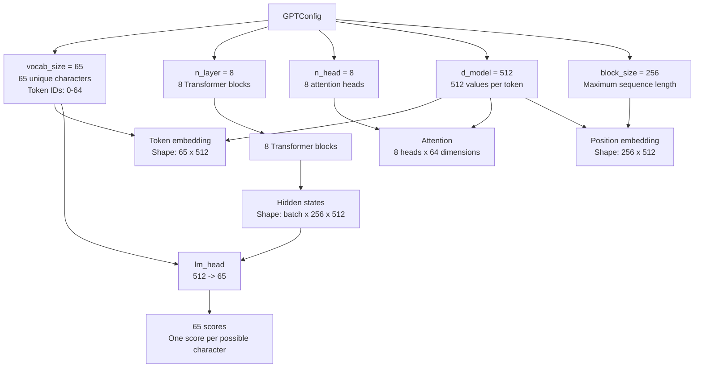

# Lab 0 — The oracle

**File:** `lab0_reference.py`, `common.py`
**Run:** `.venv/bin/python lab0_reference.py`
**Time:** ~10 seconds

The most important lab and the least interesting one. It trains the model on
one GPU and saves the loss at every step to `out/reference.pt`. Every later lab
is judged against that file.

## Why bother

A broken tensor-parallel implementation still trains. Its loss still goes down.
It just converges somewhere slightly different. Without something to compare
against, you cannot tell a correct implementation from a subtly wrong one —
and the wrong ones do not raise exceptions.

Every single bug found while building these labs was caught this way.

## Run it

```bash
cd ~/ai/shard-lab
.venv/bin/python lab0_reference.py
```

## Expected output

```
model: 25.4M params, 8 blocks, d_model=512, 8 heads, block_size=256
data:  1,115,394 tokens, vocab 65
train: 100 steps, global batch 32, fp32

  step   0  loss 4.402704
  step  20  loss 3.269731
  step  40  loss 2.789218
  step  60  loss 2.587731
  step  80  loss 2.540576
  step  99  loss 2.516004

steady state: 3.24s for 90 steps (27.8 steps/s); first 10 skipped as warmup
saved oracle -> /home/ubuntu/ai/shard-lab/out/reference.pt
  probe loss 2.497602
```

Those loss values should match **exactly**, digit for digit. If they do not,
stop and fix it before continuing — everything downstream depends on this file.

## Three design decisions worth understanding

### 1. The model is tiny and hand-written

25.4M params: 8 blocks, `d_model` 512, 8 heads, 256 context. Char-level
TinyShakespeare so there is no data pipeline to debug.

You cannot hand-shard HuggingFace's `LlamaAttention` without fighting it. You
can hand-shard 150 lines of your own code. Two choices in `common.py` exist
purely to make later labs tractable:

- **Separate `q_proj` / `k_proj` / `v_proj`** instead of one fused QKV. A fused
  projection is faster but its weight layout is interleaved, which turns Lab 3
  into index arithmetic instead of a lesson about tensor parallelism.
- **Attention written out by hand** rather than `scaled_dot_product_attention`,
  so the head dimension — the axis we shard along — is visible in the code.
- **`lm_head` is not tied to `wte`.** Tying forces the embedding and output
  projection to be sharded compatibly. That is a real problem, but not the one
  these labs teach.

### 2. Everything runs in true fp32

```python
torch.backends.cuda.matmul.allow_tf32 = False
```

This line matters more than it looks. On Blackwell a `float32` matmul will
silently use TF32 — a 10-bit mantissa — unless told otherwise, costing about
three decimal digits. That is enough to make a *correct* tensor-parallel
implementation fail a 1e-4 check, which would teach exactly the wrong lesson.

bf16 arrives only in Lab 7, where you will see agreement with the oracle
collapse from 1e-07 to 5e-03 — worse than several of the real bugs.

### 3. The batch sampler is world-size independent

```python
g = torch.Generator().manual_seed(seed + step)
ix = torch.randint(len(data) - block_size - 1, (global_batch,), generator=g)
per = global_batch // world
ix = ix[rank * per : (rank + 1) * per]
```

The *global* batch depends only on `step`, never on how many GPUs are running.
Each rank then takes its slice. A 4-GPU run therefore consumes exactly the same
tokens in exactly the same order as the 1-GPU oracle, so any divergence in the
loss curve is a bug in your parallelism and not a difference in data.

## Code workflow

Execution order, with the parts that are load-bearing called out. Line numbers
refer to `lab0_reference.py` unless stated.

### 0. Import side effects, before `main()` runs

`common.py:27` sets an environment variable *between* the `os` import and the
`torch` import:

```python
os.environ.setdefault("CUBLAS_WORKSPACE_CONFIG", ":4096:8")
import torch  # line 33
```

Not stylistic. cuBLAS reads that variable when it initialises, and without it
several reductions pick workspace-dependent split-K strategies that are not
reproducible run to run. **It must precede the first CUDA context.** Placing it
after the `torch` import happens to work today (importing torch does not create
a context) but it is a latent trap.

`common.py:38` sets `HERE = os.path.dirname(os.path.abspath(__file__))`, and
every path derives from it. That is why moving the tree does not break anything —
nothing resolves against the current working directory.

### 1. `set_determinism(0)` — line 39

Four settings, one of which carries the weight: `allow_tf32 = False`. See design
decision 2 above.

`use_deterministic_algorithms(True, warn_only=True)` is deliberate — embedding
scatter-add in the backward has no deterministic kernel. You get a warning, not
a crash, and the residual nondeterminism is far below the comparison tolerance.
The next section proves that empirically rather than assuming it.

### 2. `load_data()` — line 42

Vocabulary is **discovered, not configured**:

```python
chars = sorted(set(text))
stoi = {c: i for i, c in enumerate(chars)}
```

`sorted()` matters. A raw `set` would give a mapping that could shift between
runs, silently changing the data and therefore the loss curve. Returns
`vocab=65`, which overrides the `GPTConfig` default at line 43.

That override happens here:

```python
data, vocab_size = load_data()
cfg = GPTConfig(vocab_size=vocab_size)
```

With this corpus, `vocab_size` is `65`, so the second line is equivalent to
`GPTConfig(vocab_size=65)`. The remaining configuration values keep their
defaults: 8 transformer blocks, 8 attention heads, `d_model=512`, and a
256-token context window.

The vocabulary size controls both ends of the model. The token IDs produced by
`load_data()` range from `0` through `64`, and the model creates an embedding
table with shape `(65, 512)` and an output layer with 65 scores. Each output
score represents one possible character the model may predict next.

The main configuration values and their relationships are:



### 3. `build_model(cfg).to(device)` — line 44

The re-seed is the critical part:

```python
def build_model(cfg=None, seed=0):      # common.py:358
    torch.manual_seed(seed)             # re-seeds, unconditionally
    return GPT(cfg)
```

The seed is set *inside* `build_model`, not merely once at startup, so
construction is independent of whatever consumed RNG beforehand. In Labs 2-7,
where every rank calls this, that is what guarantees all four ranks build
byte-identical weights before any sharding — the precondition for the entire
oracle comparison.

It builds on **CPU** and then moves to the device, so initialisation uses CPU
RNG and cannot be perturbed by per-GPU RNG state.

The call in Lab 0 combines both operations:

```python
model = build_model(cfg).to(device)
```

`build_model(cfg)` creates the GPT model using the configuration and returns a
fully initialised model whose parameters are still on the CPU. The chained
`.to(device)` moves the model's parameters and buffers to `device`, which is
`cuda:0` in this lab. After this line, inputs must also be placed on the same
GPU before being passed to the model.

`GPT._init` touches only `Linear` and `Embedding` (`normal_(std=0.02)`, zero
bias). LayerNorms are intentionally skipped, keeping PyTorch's default
weight=1 / bias=0.

### 4. Optimizer — line 54

```python
torch.optim.AdamW(model.parameters(), lr=3e-4, betas=(0.9, 0.95), weight_decay=0.1)
```

`betas=(0.9, 0.95)` is the LLM convention, not torch's `(0.9, 0.999)` default.

One honest simplification: weight decay is applied to **everything**, including
biases and LayerNorm gains. Real training excludes those. It does not matter
here because the oracle only has to be self-consistent — but do not copy this
into a real run.

### 5. The training loop — lines 61-71

```python
timer.tick(step)
x, y = get_batch(data, step, GLOBAL_BATCH, cfg.block_size, device)
_, loss = model(x, y)
opt.zero_grad(set_to_none=True)
loss.backward()
torch.nn.utils.clip_grad_norm_(model.parameters(), 1.0)
opt.step()
losses.append(loss.item())
```

Five things worth knowing:

**`get_batch(step)` is world-size independent.** A fresh
`torch.Generator().manual_seed(1234 + step)` picks the indices, so the global
batch depends only on the step number. `rank`/`world` default to `0`/`1` here;
later labs pass real values and take a slice of the *same* batch.
`x = data[i:i+256]`, `y = data[i+1:i+1+256]` is the standard next-token shift.

**`zero_grad` sits after the forward.** Unusual placement but correct —
gradients are consumed only during `backward()`. What matters is that it
precedes `backward()`.

**`set_to_none=True` frees the gradient tensors** rather than zeroing them.
Harmless here; in Lab 5 it is the mechanism behind the ZeRO-1 NaN bug, because
`opt.zero_grad()` on a subset-owning optimizer leaves the other gradients alive
and accumulating.

**`clip_grad_norm_` is correct here and only here.** On one GPU
`model.parameters()` is the whole model, so the norm is genuinely global. This
exact line, unchanged, is bug (e) in Lab 3: under tensor parallelism it norms
over local shards only, under-clips, and shifts the loss by 7.1e-02.

**`loss.item()` forces a device sync every step.** Fine for an oracle, and it
arguably makes the timing more honest, but you would not do this in a
throughput-sensitive loop.

### 6. Timing — 90 steps, not 100

`StepTimer(warmup=10)` starts the clock at step 10 after a
`cuda.synchronize()`. All 100 steps still execute, so the loss curve is
unaffected. It exists because the first run of this file reported 23.7s, of
which roughly 19 seconds were one-time JIT compilation.

### 7. The probe forward — lines 81-84

```python
model.eval()
with torch.no_grad():
    xr, yr = get_batch(data, 10_000, 8, cfg.block_size, device)
    ref_logits, ref_loss = model(xr, yr)
```

`step=10_000` is deliberately far outside the training range `0..99`, so the
generator produces a batch the model never trained on. Batch 8 keeps
`ref_logits` small — `8 x 256 x 65` floats, about 532 KB in the saved file.

This gives Lab 3 a **pure forward-pass check**. Comparing logits on a fixed
batch isolates forward bugs from anything in the optimizer trajectory, which is
how the missing-`f` bug was pinned to gradients specifically.

### 8. Save — line 87

`state_dict` is moved to CPU so it loads anywhere. `cfg` is a pickled
dataclass, which is why every reader passes `weights_only=False`.

### A sanity check worth knowing

At initialisation the model should predict roughly uniformly over 65
characters, so the loss should start near `ln(65) = 4.174`. Observed:
**4.4027** — just above, because `lm_head` is initialised to `normal(std=0.02)`
rather than zeros, so the logits are not perfectly flat.

Use this to triage a broken run:

| First loss | Likely cause |
|---|---|
| ~4.17 | correct |
| ~11 (`ln(65535)`?) | vocab mapping or embedding init is wrong |
| ~0.5 | targets are leaking into the inputs |
| `nan` | learning rate or init blew up on step 0 |

Ending at 2.516 means it learned character-level statistics, which is about
what 100 steps buys.

### Open questions / things to improve

- Weight decay currently hits biases and LayerNorm gains. Splitting into decay
  and no-decay parameter groups would be more realistic, but changes the oracle
  and so invalidates every saved comparison. Worth doing deliberately, with a
  regenerated `reference.pt`, not by accident.
- `get_batch` calls `.to(device, non_blocking=True)` on unpinned CPU tensors, so
  `non_blocking` is effectively a no-op. Pinning the source would make it real.
- The probe is a single fixed batch. A handful of probes at different steps
  would localise forward bugs more precisely.
- `loss.item()` every step syncs. An accumulate-on-device-and-sync-once variant
  would be faster, at the cost of some timing honesty.

## Determinism is real — verify it yourself

```bash
cp out/reference.pt out/reference_orig.pt
.venv/bin/python lab0_reference.py
.venv/bin/python -c "
import torch
a = torch.load('out/reference_orig.pt', weights_only=False)
b = torch.load('out/reference.pt', weights_only=False)
print('losses identical:', a['losses'] == b['losses'])
print('logits delta    :', (a['ref_logits'] - b['ref_logits']).abs().max().item())
"
```

Expected: `True` and `0.0`. Bit-identical across independent processes.

`set_determinism` uses `warn_only=True` because a couple of backward kernels
(embedding scatter-add) have no deterministic implementation. You will see a
warning; the residual nondeterminism is far below the comparison tolerance, as
the check above demonstrates.

## What gets saved

| Key | Used by |
|---|---|
| `losses` | every lab, via `check_against_reference` |
| `state_dict` | Lab 3, sliced onto each rank to compare logits |
| `ref_logits`, `ref_loss` | Lab 3 forward check |
| `cfg`, `global_batch`, `steps`, `lr` | reproducing the setup |

## Read the instrumentation before moving on

`common.py` provides three tools you will use in every lab:

- **`rank_print(..., only=None)`** — serialised per-rank output. Contains a
  barrier, so **every rank must call it**. The `only` argument filters which
  ranks print without changing which ranks participate.
- **`describe_shards(model, global_shapes)`** — prints what slice of each
  parameter lives on this GPU, marking anything sharded. Read this *before* you
  look at the loss; if the shapes are wrong the loss will not tell you why.
- **`StepTimer(warmup=10)`** — timing that discards the first steps. Without it
  the first process to touch a kernel pays JIT compilation, which inflated this
  lab's original measurement from 3.24s to 23.7s.

## Exercises

1. Set `allow_tf32 = True` and rerun. How far does the loss move? Is that more
   or less than the 1.8e-02 error caused by the real `no-f` bug in Lab 3?
2. Change the seed in `get_batch` and confirm the loss curve changes, then
   change it back. This is what a data mismatch looks like, so you recognise it
   later.
3. Time 100 steps without `StepTimer`. Reproduce the ~23s figure and convince
   yourself where the missing 20 seconds went.
